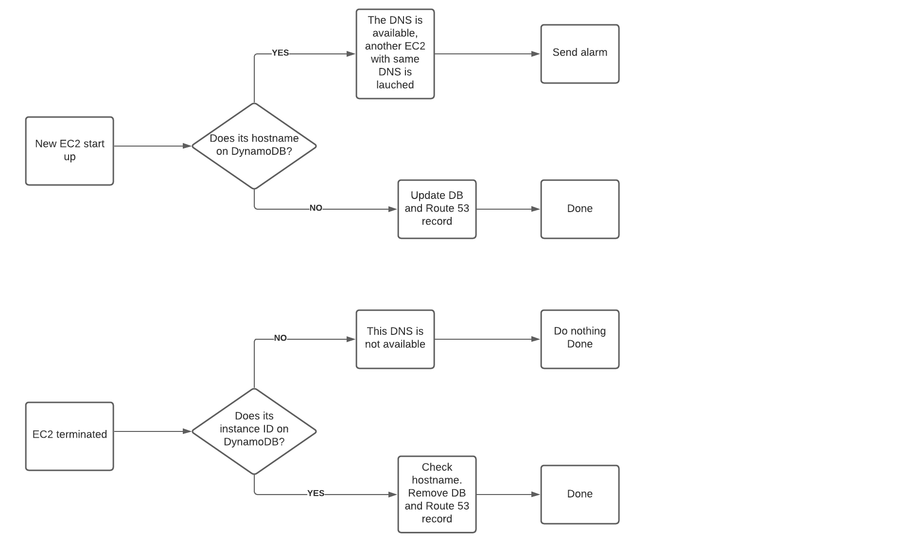
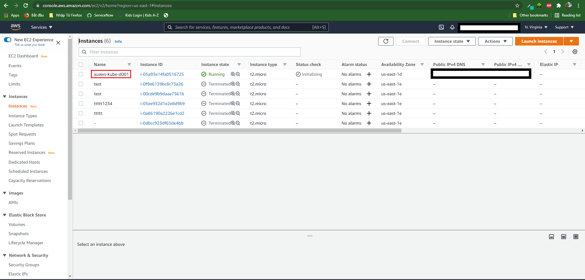
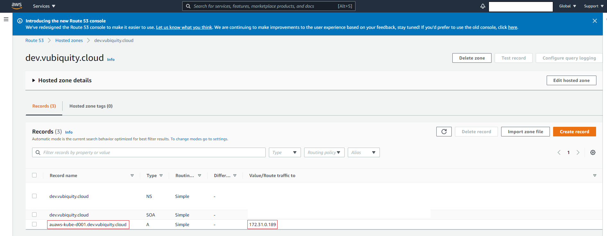

# Dynamic DNS
##### Using CloudWatch Event EC2 Notification triggering Lambda function to update Private IP address as an A record to Route 53 Private Zone, also using DynamoDB to store the information.
##### The Name Tags is using to identify the hostname of the server

## The solution 
1. Creating Infrastruture using Terraform: Route 53 Private Zone, CloudWatch Event, Lambda function, DynamoDB.
2. Using CloudWatch Event EC2 Notification - Running triggering Lambda function to update Private IP address as an A record to Route 53 Private Zone, also update to DynamoDB record.
3. Using CloudWatch Event EC2 Notification - Terminated triggering Lambda function to remove Private IP address from Route 53 Private Hosted Zone, also remove to DynamoDB record.

## Details
#### You must have Bastion host with terrafomr installed.
1. Configure AWS credentials
```
aws configure
AWS Access Key ID [****************WWVC]:

```
2. Check VPC ID in your AWS account and edit it in main.tfvars
```
#Environment
region = "us-east-1"
environment = "dev"

#Route 53
private_hosted_zone_name = "dev.XXXXXXXXXXXXXXX.cloud"  --> Change your Route 53 private hosted zone name here
vpc_id = "vpc-XXXXXXXXXXXXXXXXXXXXXXXXXXX" --> Change your VPC ID here
record_type = "A"

#Lambda variables
lambda_name = "Dynamic_DNS_update"
python_filename = "DNS_update.zip"
handler_name = "DNS_update.lambda_handler"
lambda_timeout = 60
lambda_memory_size = 512
```
3. Terraform init
```
terraform init
Initializing the backend...

Initializing provider plugins...
- Reusing previous version of hashicorp/aws from the dependency lock file
- Installing hashicorp/aws v3.45.0...
- Installed hashicorp/aws v3.45.0 (signed by HashiCorp)

Terraform has been successfully initialized!

You may now begin working with Terraform. Try running "terraform plan" to see
any changes that are required for your infrastructure. All Terraform commands
should now work.

If you ever set or change modules or backend configuration for Terraform,
rerun this command to reinitialize your working directory. If you forget, other
commands will detect it and remind you to do so if necessary.
```
3. Terraform plan
```
$ terraform.exe plan -var-file=main.tfvars

Terraform used the selected providers to generate the following execution
plan. Resource actions are indicated with the following symbols:
  + create

Terraform will perform the following actions:

  # aws_cloudwatch_event_rule.ec2_running_terminated will be created
  + resource "aws_cloudwatch_event_rule" "ec2_running_terminated" {
      + arn            = (known after apply)
      + description    = "Calling DNS update Lambda when EC2 is running or being terminated"
      + event_bus_name = "default"
      + event_pattern  = jsonencode(
            {
              + detail      = {
                  + state = [
                      + "running",
                      + "terminated",
                    ]
                }
              + detail-type = [
                  + "EC2 Instance State-change Notification",
                ]
              + source      = [
                  + "aws.ec2",
                ]
            }
        )
      + id             = (known after apply)
      + is_enabled     = true
      + name           = "ec2_running_terminated"
      + name_prefix    = (known after apply)
      + tags_all       = (known after apply)
    }

  # aws_cloudwatch_event_target.ddns-rule will be created
  + resource "aws_cloudwatch_event_target" "ddns-rule" {
      + arn            = (known after apply)
      + event_bus_name = "default"
      + id             = (known after apply)
      + rule           = "ec2_running_terminated"
      + target_id      = (known after apply)
    }

  # aws_dynamodb_table.dynamoic_dns_table will be created
  + resource "aws_dynamodb_table" "dynamoic_dns_table" {
      + arn              = (known after apply)
      + billing_mode     = "PAY_PER_REQUEST"
      + hash_key         = "hostname"
      + id               = (known after apply)
      + name             = "DDNS"
      + stream_arn       = (known after apply)
      + stream_label     = (known after apply)
      + stream_view_type = (known after apply)
      + tags             = {
          + "Name" = "dev"
        }
      + tags_all         = {
          + "Name" = "dev"
        }

      + attribute {
          + name = "hostname"
          + type = "S"
        }

      + point_in_time_recovery {
          + enabled = (known after apply)
        }

      + server_side_encryption {
          + enabled     = (known after apply)
          + kms_key_arn = (known after apply)
        }
    }

  # aws_iam_role.iam_for_lambda will be created
  + resource "aws_iam_role" "iam_for_lambda" {
      + arn                   = (known after apply)
      + assume_role_policy    = jsonencode(
            {
              + Statement = [
                  + {
                      + Action    = "sts:AssumeRole"
                      + Effect    = "Allow"
                      + Principal = {
                          + Service = "lambda.amazonaws.com"
                        }
                      + Sid       = ""
                    },
                ]
              + Version   = "2012-10-17"
            }
        )
      + create_date           = (known after apply)
      + force_detach_policies = false
      + id                    = (known after apply)
      + managed_policy_arns   = (known after apply)
      + max_session_duration  = 3600
      + name                  = "Dynamic_DNS_update"
      + path                  = "/"
      + tags_all              = (known after apply)
      + unique_id             = (known after apply)

      + inline_policy {
          + name   = "Dynamic_DNS_update"
          + policy = jsonencode(
                {
                  + Statement = [
                      + {
                          + Action   = "ec2:Describe*"
                          + Effect   = "Allow"
                          + Resource = "*"
                        },
                      + {
                          + Action   = [
                              + "dynamodb:*",
                            ]
                          + Effect   = "Allow"
                          + Resource = "*"
                        },
                      + {
                          + Action   = [
                              + "logs:CreateLogGroup",
                              + "logs:CreateLogStream",
                              + "logs:PutLogEvents",
                            ]
                          + Effect   = "Allow"
                          + Resource = "*"
                        },
                      + {
                          + Action   = [
                              + "route53:*",
                            ]
                          + Effect   = "Allow"
                          + Resource = [
                              + "*",
                            ]
                        },
                    ]
                  + Version   = "2012-10-17"
                }
            )
        }
    }

  # aws_lambda_function.dynamic_dns will be created
  + resource "aws_lambda_function" "dynamic_dns" {
      + arn                            = (known after apply)
      + description                    = "DNS_update.zip"
      + filename                       = "DNS_update.zip"
      + function_name                  = "Dynamic_DNS_update"
      + handler                        = "DNS_update.lambda_handler"
      + id                             = (known after apply)
      + invoke_arn                     = (known after apply)
      + last_modified                  = (known after apply)
      + memory_size                    = 512
      + package_type                   = "Zip"
      + publish                        = true
      + qualified_arn                  = (known after apply)
      + reserved_concurrent_executions = -1
      + role                           = (known after apply)
      + runtime                        = "python3.8"
      + signing_job_arn                = (known after apply)
      + signing_profile_version_arn    = (known after apply)
      + source_code_hash               = "6vHYPLKCDK/7563KObFEhb4x563TNw7r5sqnwIOxg90="
      + source_code_size               = (known after apply)
      + tags_all                       = (known after apply)
      + timeout                        = 60
      + version                        = (known after apply)

      + environment {
          + variables = (known after apply)
        }

      + tracing_config {
          + mode = (known after apply)
        }
    }

  # aws_lambda_permission.allow_cloudwatch_to_call_dns_lambda will be created
  + resource "aws_lambda_permission" "allow_cloudwatch_to_call_dns_lambda" {
      + action        = "lambda:InvokeFunction"
      + function_name = "Dynamic_DNS_update"
      + id            = (known after apply)
      + principal     = "events.amazonaws.com"
      + source_arn    = (known after apply)
      + statement_id  = "AllowExecutionFromCloudWatch"
    }

  # aws_route53_zone.private will be created
  + resource "aws_route53_zone" "private" {
      + comment       = "Managed by Terraform"
      + force_destroy = true
      + id            = (known after apply)
      + name          = "dev.vubiquity.cloud"
      + name_servers  = (known after apply)
      + tags_all      = (known after apply)
      + zone_id       = (known after apply)

      + vpc {
          + vpc_id     = "vpc-09d6fa553b152264e"
          + vpc_region = (known after apply)
        }
    }

Plan: 7 to add, 0 to change, 0 to destroy.

Changes to Outputs:
  + DYNAMO_DB_TABLE     = (known after apply)
  + LAMBDA_FUNCTION_ARN = (known after apply)

Note: You didn't use the -out option to save this plan, so Terraform can't
guarantee to take exactly these actions if you run "terraform apply" now.
```
4. Check if there is not any error and apply the infra-structure
```
$ terraform.exe apply -var-file=main.tfvars -auto-approve

Terraform used the selected providers to generate the following execution
plan. Resource actions are indicated with the following symbols:
  + create

Terraform will perform the following actions:

  # aws_cloudwatch_event_rule.ec2_running_terminated will be created
  + resource "aws_cloudwatch_event_rule" "ec2_running_terminated" {
      + arn            = (known after apply)
      + description    = "Calling DNS update Lambda when EC2 is running or being terminated"
      + event_bus_name = "default"
      + event_pattern  = jsonencode(
            {
              + detail      = {
                  + state = [
                      + "running",
                      + "terminated",
                    ]
                }
              + detail-type = [
                  + "EC2 Instance State-change Notification",
                ]
              + source      = [
                  + "aws.ec2",
                ]
            }
        )
      + id             = (known after apply)
      + is_enabled     = true
      + name           = "ec2_running_terminated"
      + name_prefix    = (known after apply)
      + tags_all       = (known after apply)
    }

  # aws_cloudwatch_event_target.ddns-rule will be created
  + resource "aws_cloudwatch_event_target" "ddns-rule" {
      + arn            = (known after apply)
      + event_bus_name = "default"
      + id             = (known after apply)
      + rule           = "ec2_running_terminated"
      + target_id      = (known after apply)
    }

  # aws_dynamodb_table.dynamoic_dns_table will be created
  + resource "aws_dynamodb_table" "dynamoic_dns_table" {
      + arn              = (known after apply)
      + billing_mode     = "PAY_PER_REQUEST"
      + hash_key         = "hostname"
      + id               = (known after apply)
      + name             = "DDNS"
      + stream_arn       = (known after apply)
      + stream_label     = (known after apply)
      + stream_view_type = (known after apply)
      + tags             = {
          + "Name" = "dev"
        }
      + tags_all         = {
          + "Name" = "dev"
        }

      + attribute {
          + name = "hostname"
          + type = "S"
        }

      + point_in_time_recovery {
          + enabled = (known after apply)
        }

      + server_side_encryption {
          + enabled     = (known after apply)
          + kms_key_arn = (known after apply)
        }
    }

  # aws_iam_role.iam_for_lambda will be created
  + resource "aws_iam_role" "iam_for_lambda" {
      + arn                   = (known after apply)
      + assume_role_policy    = jsonencode(
            {
              + Statement = [
                  + {
                      + Action    = "sts:AssumeRole"
                      + Effect    = "Allow"
                      + Principal = {
                          + Service = "lambda.amazonaws.com"
                        }
                      + Sid       = ""
                    },
                ]
              + Version   = "2012-10-17"
            }
        )
      + create_date           = (known after apply)
      + force_detach_policies = false
      + id                    = (known after apply)
      + managed_policy_arns   = (known after apply)
      + max_session_duration  = 3600
      + name                  = "Dynamic_DNS_update"
      + path                  = "/"
      + tags_all              = (known after apply)
      + unique_id             = (known after apply)

      + inline_policy {
          + name   = "Dynamic_DNS_update"
          + policy = jsonencode(
                {
                  + Statement = [
                      + {
                          + Action   = "ec2:Describe*"
                          + Effect   = "Allow"
                          + Resource = "*"
                        },
                      + {
                          + Action   = [
                              + "dynamodb:*",
                            ]
                          + Effect   = "Allow"
                          + Resource = "*"
                        },
                      + {
                          + Action   = [
                              + "logs:CreateLogGroup",
                              + "logs:CreateLogStream",
                              + "logs:PutLogEvents",
                            ]
                          + Effect   = "Allow"
                          + Resource = "*"
                        },
                      + {
                          + Action   = [
                              + "route53:*",
                            ]
                          + Effect   = "Allow"
                          + Resource = [
                              + "*",
                            ]
                        },
                    ]
                  + Version   = "2012-10-17"
                }
            )
        }
    }

  # aws_lambda_function.dynamic_dns will be created
  + resource "aws_lambda_function" "dynamic_dns" {
      + arn                            = (known after apply)
      + description                    = "DNS_update.zip"
      + filename                       = "DNS_update.zip"
      + function_name                  = "Dynamic_DNS_update"
      + handler                        = "DNS_update.lambda_handler"
      + id                             = (known after apply)
      + invoke_arn                     = (known after apply)
      + last_modified                  = (known after apply)
      + memory_size                    = 512
      + package_type                   = "Zip"
      + publish                        = true
      + qualified_arn                  = (known after apply)
      + reserved_concurrent_executions = -1
      + role                           = (known after apply)
      + runtime                        = "python3.8"
      + signing_job_arn                = (known after apply)
      + signing_profile_version_arn    = (known after apply)
      + source_code_hash               = "6vHYPLKCDK/7563KObFEhb4x563TNw7r5sqnwIOxg90="
      + source_code_size               = (known after apply)
      + tags_all                       = (known after apply)
      + timeout                        = 60
      + version                        = (known after apply)

      + environment {
          + variables = (known after apply)
        }

      + tracing_config {
          + mode = (known after apply)
        }
    }

  # aws_lambda_permission.allow_cloudwatch_to_call_dns_lambda will be created
  + resource "aws_lambda_permission" "allow_cloudwatch_to_call_dns_lambda" {
      + action        = "lambda:InvokeFunction"
      + function_name = "Dynamic_DNS_update"
      + id            = (known after apply)
      + principal     = "events.amazonaws.com"
      + source_arn    = (known after apply)
      + statement_id  = "AllowExecutionFromCloudWatch"
    }

  # aws_route53_zone.private will be created
  + resource "aws_route53_zone" "private" {
      + comment       = "Managed by Terraform"
      + force_destroy = true
      + id            = (known after apply)
      + name          = "dev.vubiquity.cloud"
      + name_servers  = (known after apply)
      + tags_all      = (known after apply)
      + zone_id       = (known after apply)

      + vpc {
          + vpc_id     = "vpc-09d6fa553b152264e"
          + vpc_region = (known after apply)
        }
    }

Plan: 7 to add, 0 to change, 0 to destroy.

Changes to Outputs:
  + DYNAMO_DB_TABLE     = (known after apply)
  + LAMBDA_FUNCTION_ARN = (known after apply)
aws_route53_zone.private: Creating...
aws_iam_role.iam_for_lambda: Creating...
aws_cloudwatch_event_rule.ec2_running_terminated: Creating...
aws_cloudwatch_event_rule.ec2_running_terminated: Creation complete after 2s [id=ec2_running_terminated]
aws_iam_role.iam_for_lambda: Creation complete after 4s [id=Dynamic_DNS_update]
aws_route53_zone.private: Still creating... [10s elapsed]
aws_route53_zone.private: Still creating... [20s elapsed]
aws_route53_zone.private: Still creating... [30s elapsed]
aws_route53_zone.private: Still creating... [40s elapsed]
aws_route53_zone.private: Still creating... [50s elapsed]
aws_route53_zone.private: Still creating... [1m0s elapsed]
aws_route53_zone.private: Creation complete after 1m2s [id=Z042316734L28ADMBXG48]
aws_dynamodb_table.dynamoic_dns_table: Creating...
aws_dynamodb_table.dynamoic_dns_table: Still creating... [10s elapsed]
aws_dynamodb_table.dynamoic_dns_table: Creation complete after 10s [id=DDNS]
aws_lambda_function.dynamic_dns: Creating...
aws_lambda_function.dynamic_dns: Creation complete after 9s [id=Dynamic_DNS_update]
aws_lambda_permission.allow_cloudwatch_to_call_dns_lambda: Creating...
aws_lambda_permission.allow_cloudwatch_to_call_dns_lambda: Creation complete after 2s [id=AllowExecutionFromCloudWatch]
aws_cloudwatch_event_target.ddns-rule: Creating...
aws_cloudwatch_event_target.ddns-rule: Creation complete after 1s [id=ec2_running_terminated-terraform-20210623085940593800000002]

Apply complete! Resources: 7 added, 0 changed, 0 destroyed.

Outputs:
```
5. Create an EC2 instance with Tags Key = Name, Value = Test

6. Check the Route 53 A record is available in Privated Host Zone with hostname = Tags.Name, value = Private IP address

7. Terminate EC2 instance with Tags Key = Name, Value = Test
8. Check the Route 53 A record is removed in Privated Host Zone